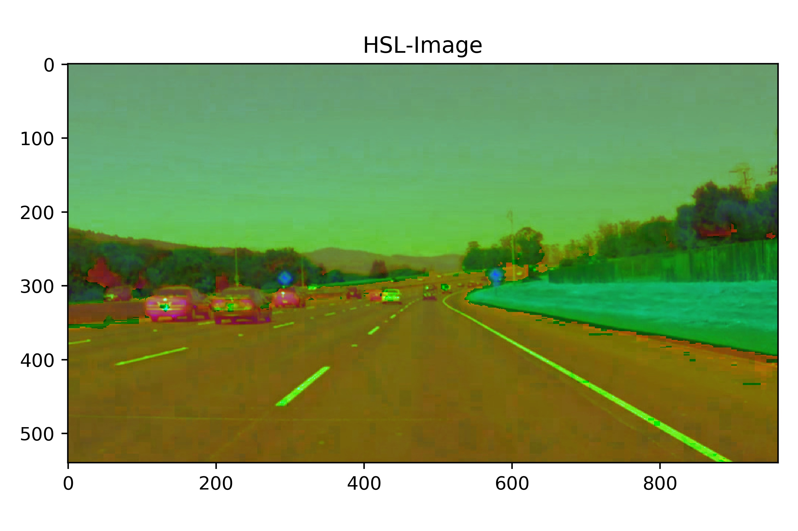
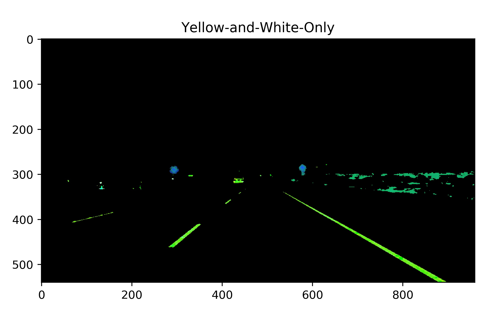
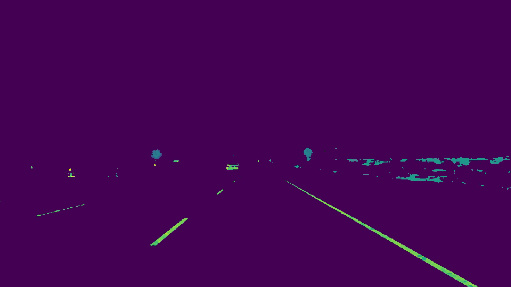
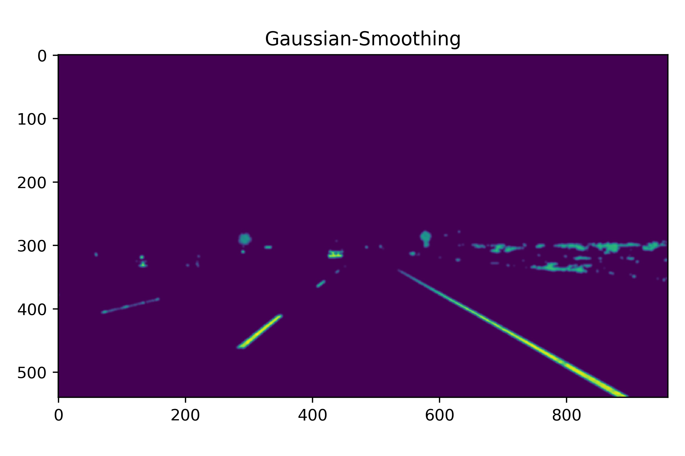
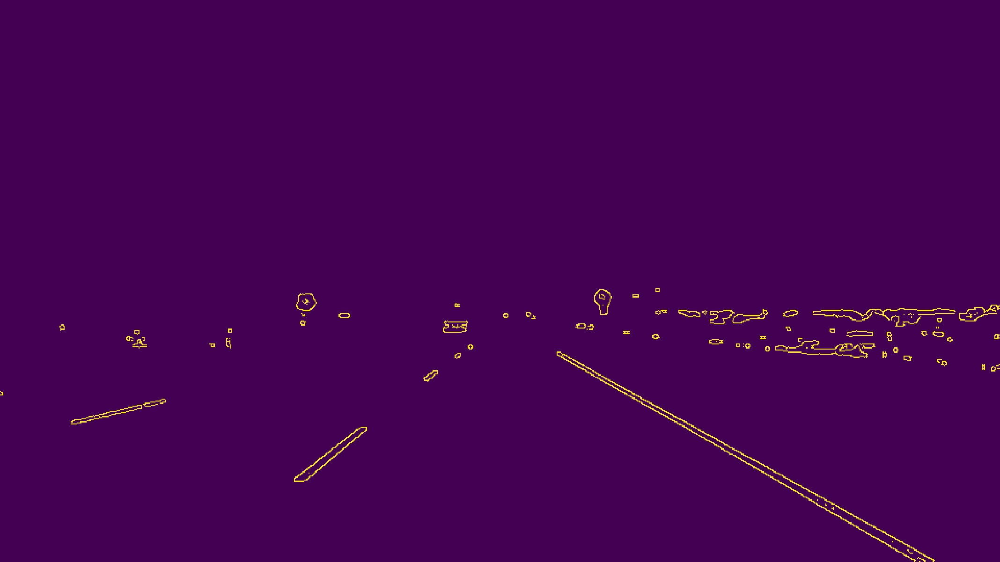
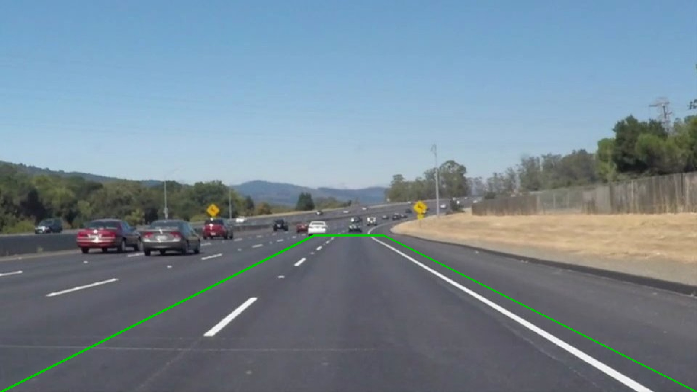
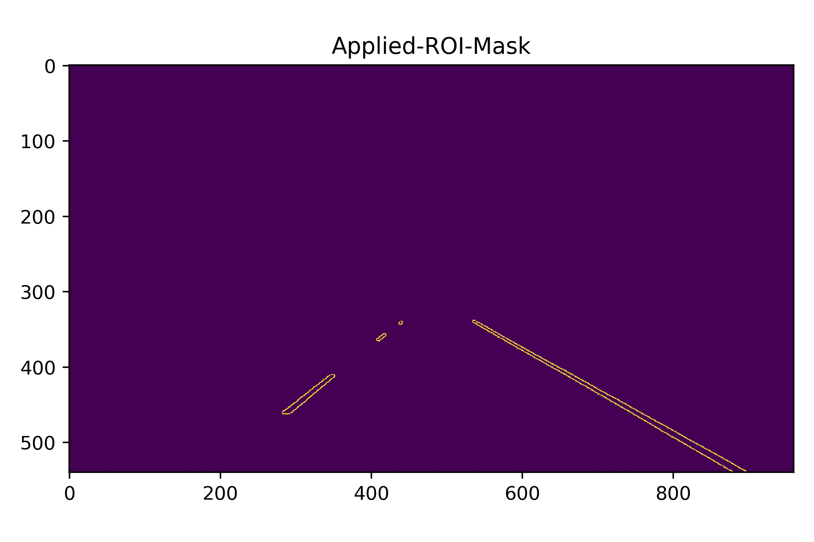
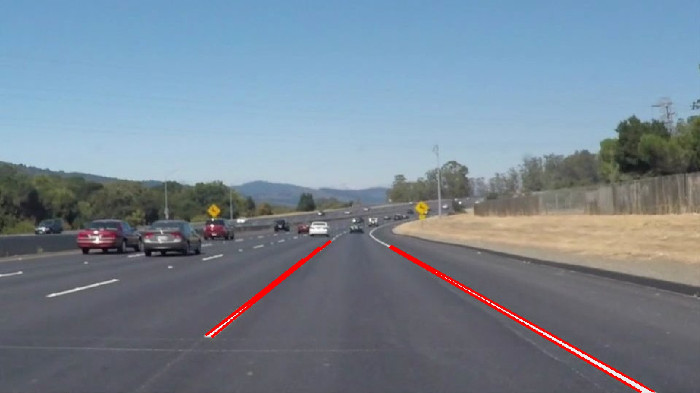
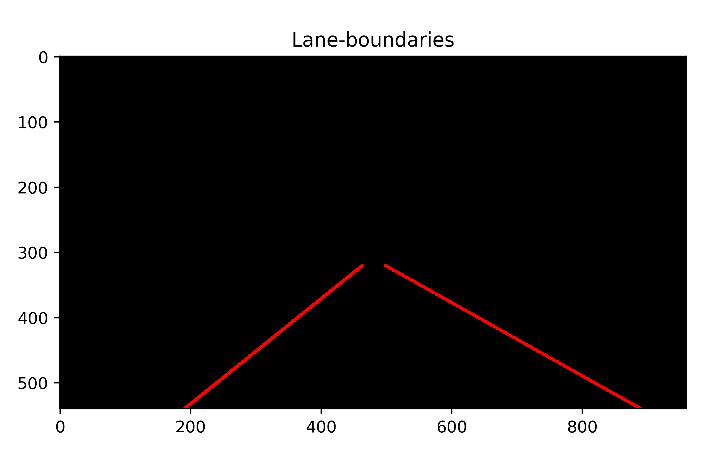
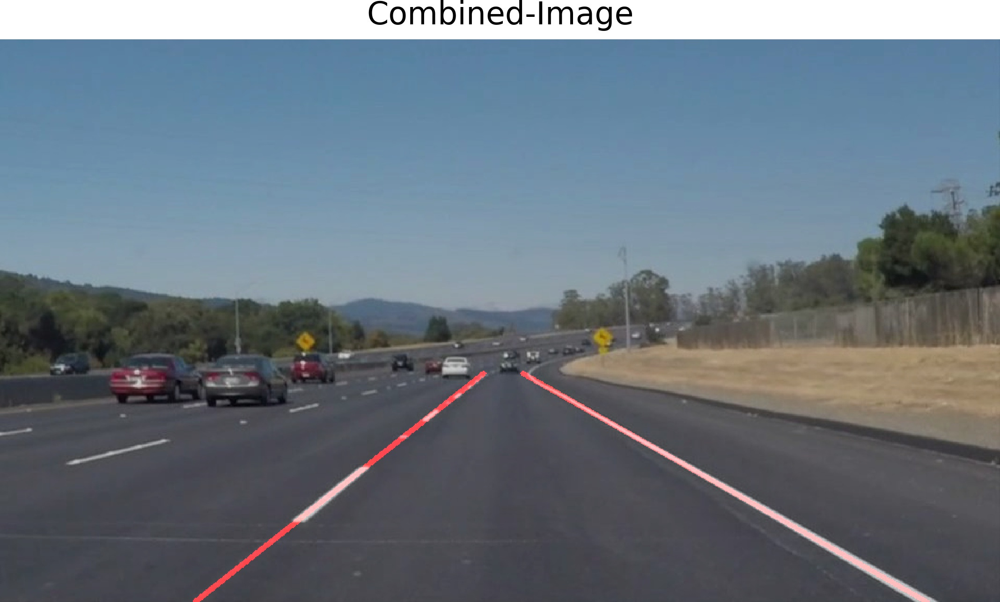

# **Finding Lane Lines on the Road** 

## Writeup

---

**Finding Lane Lines on the Road**

In this project lane lines in images are detected using Python and OpenCV.

---

### Report

### 1) Pipeline 

My pipeline consists of ten steps:

1. Convert RGB to HSL
2. Extract Yellow and White Colors
3. Grayscale Transform
4. Gaussian Smoothing
5. Canny Edge Detection
6. Region of Interest
7. Line Detection by Hough Transformation
8. Construct Boundary Lines
9. Smoothing of Lines
10. Annotate Image by Boundaries

In the following, these steps are explained and demonstrated by this example image: 


**Figure 1** - Input Image

#### 1. Convert RGB to HSL

I converted the image to HSL because working with HSL values is much easier to isolate colors.
In the HSL representation of color, hue determines the color you want, saturation determines how intense the color is and lightness determines the lightness of the image.
The input RGB image converted to the HSL colorspace looks like this:



#### 2. Extract Yellow and White Colors

Lane lines can be yellow or white. Therefore, I extracted these two colors from the image.
For the white color, I chose high light value (205 - 255). I did not filter hue, saturation values.
For the yellow color, I chose hue between 10 and 40 to choose yellow color. I chose relatively high saturation and did not filter light value for he yellow color selection.
The result of the color selection is shown below.



#### 3. Grayscale Transform

The resulting image is converted into gray scaled image in order to detect shapes. In a greyscale image the value of each pixel is a single sample representing only an amount of light,



#### 4. Gaussian Smoothing

Before detecting the edges, a Gaussian filter is executed on the image. I applied the Gaussian filter to smooth out the noise and also smooth the edges.
Thus, I used Gaussian Smoothing with a kernel size of 7. The blurred image is shown below.



#### 5. Canny Edge Detection

The Canny algorithm is used for the edge detection. This function takes as input a lower and an upper threshold. 
If a pixel gradient is higher than the upper threshold, the pixel is accepted as an edge
If a pixel gradient value is below the lower threshold, then it is rejected. 
If the pixel gradient is between the two thresholds, then it will be accepted only if it is connected to a pixel that is above the upper threshold.  
One issue with Canny edge detection algorithm is that we need to specify a high threshold and a low threshold. The selection of those threshold values affect the quality of the detected edge greatly.
Therefore, I decided to select the two thresholds automatically. I calculated the thresholds based on the median color in the gray scale image. 
The lower threshold is `0.66 * median_intensity` and the upper one `1.33 * median_intensity` accordingly.
                                                                



#### 6. Region of Interest

As can be seen there are many edges detected by Canny but this is actually not we want as it contains not important sections of the image like the sky, hills, and other lanes. Thus, I defined a region of interest (ROI). 
This region of interest is a polygon constructed based on the shape of the input image. The region of interest for our example image can be seen in the image below (in green).



This region of interest is applied on the detected edges. Edges outside this region are excluded:



#### 7. Line Detection by Hough Transformation

I am using Hough Line Transformation to detect lines in the edge image. I used the following parameters:

* rho = 2,
* theta = pi/180,
* threshold = 30,
* min_line_length = 40,
* max_line_gap = 100.



#### 8. Construct Boundary Lines

Multiple lines are detected by the Hough Line Transformation. I separated these lines based on the slope into a right and left boundary line.
The left boundary has a positive slope, and the right lane has a negative slope. With all these line coordinate, one can find the best first order polynomial line by least-square fitting. This is performed for the left and right boundary separately.
This procedure results in two lines of the form ```y = mx + b```:



#### 9. Smoothing of Lines

__Note: This step is only applied for videos and not for single images!__

A video is a sequence of frames. Therefore, I used the results from previous frames to smooth the boundary lines. By doing so, one can identify high deviations and avoid _shaking_ between frames.
I used a data structure to store the last five boundary lines parameters. Based on this history and the current parameters of the boundary lines, I calculate a mean value for the slope and intercept.
In case, the slope or intercept of the left or right boundary differs by more than 15% with respect to previous frames, I omit the current parameters and
determine the parameters from the history.

#### 10. Annotate Image by Boundaries

Finally, the lane line boundaries are stacked in the original image:



### 2) Shortcomings of the pipeline


1. One potential shortcoming is the boundary construction. Currently, I use a first order polynomial to approximate the lane boundaries. This works great for straight lanes but does not work so well for curvy road segments.  
2. Another shortcoming are the fixed parameters of the pipeline. While I tried to determine parameters dynamically (e.g. automatic thresholds for canny), there are still a lot of fixed values that might not work well for other examples.

### 3) Possible improvements to the pipeline

1. Straigh line problem

A possible improvement would be to approximate the boundary lines more accurately. A higher order polynomial should provide a better solution. A more advanced solution could be distinguishing between three segments:

* straight lines,
* clothoids,
* arcs.

Based on these segments the boundary could be constructed.

2. Fixed parameters

This issue could be fixed by using machine learning techniques. A deep neural network could be trained on collected data.